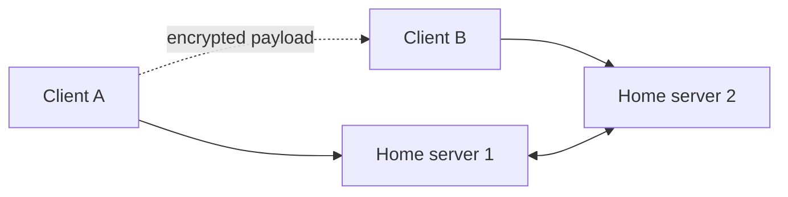

# OLAF Neighbourhood Chat — Encrypted Protocol Prototype

A multi-server messaging prototype implementing the University of Adelaide's
OLAF/Neighbourhood protocol. Clients connect to a home server, discover users on
directly connected neighbours, and exchange private, group, broadcast, and file
messages over WebSockets.

> Academic four-person team project. This is a protocol-learning prototype, not a
> production messenger and not an independently audited cryptographic product.

[中文说明](#中文说明)

## Implemented concepts

- Multiple WebSocket servers joined in a neighbourhood topology.
- RSA-2048 OAEP key wrapping and RSA-PSS/SHA-256 message signatures.
- AES-256-GCM authenticated encryption for message payloads.
- Monotonically increasing counters checked by the server to reject replayed
  signed messages.
- Direct, group, and broadcast messaging plus HTTP file transfer.
- Online-user and public-key synchronisation between neighbouring servers.

## Security scope

The code demonstrates protocol and cryptography APIs in an academic setting. It
uses locally generated, unencrypted PEM keys and plain `ws://`/`http://` transport
by default. Identity binding, secure key storage, TLS deployment, trust-on-first-use
handling, file-upload hardening, and a formal security review are outside the
project scope. Do not use it for sensitive or production communication.

Legacy course code that accessed local sensitive files has been removed from the
public tree and Git history. The remaining code should still be treated as an
educational prototype.

## Quick start

Requires Python 3.8+.

```bash
python -m venv .venv
source .venv/bin/activate
pip install -r requirements.txt
```

Start two neighbouring servers:

```bash
python -m server.server --host 127.0.0.1 --port 8000 --neighbors ws://127.0.0.1:8001
python -m server.server --host 127.0.0.1 --port 8001 --neighbors ws://127.0.0.1:8000
```

Then connect clients in separate terminals:

```bash
python -m client.client --host 127.0.0.1 --port 8000
python -m client.client --host 127.0.0.1 --port 8001
```

Each server exposes its WebSocket port and an HTTP file-transfer port at
`websocket_port + 100`.

## Commands

- `/list` — list online users known to the neighbourhood.
- `/broadcast <message>` — broadcast to users in the neighbourhood.
- `/msg <user1,user2> <message>` — send a private or group message.
- `/get_public_key <username>` — request a user's public key.
- `/upload <path>` and `/download <url>` — transfer a file through the home
  server.

## Protocol sketch



Messages use an RSA-PSS signature over the payload and counter. Private/group
payloads use a fresh 256-bit AES key with GCM authentication, and that key is
wrapped for each recipient using RSA-OAEP/SHA-256.

## Team attribution

Group 6: Zhihan Yang, Xiao Liu, Danyang Zhang, and Yuzhe Zhang. See Git history
and the original requirements under `Requirements/` for the project record.

## 中文说明

本项目是阿德莱德大学四人团队完成的 OLAF/Neighbourhood 协议原型。客户端通过
WebSocket 连接各自的 home server，服务器组成邻居拓扑，并支持私聊、群聊、
广播、用户同步和文件传输。代码实现了 RSA-2048 OAEP、RSA-PSS/SHA-256、
AES-256-GCM 与单调计数器防重放机制。

它是教学用途的协议实现，并未经过独立安全审计；默认传输、密钥存储和文件上传
也不满足生产环境要求。公开历史中原有的本地敏感文件访问模块已移除，简历中应
描述为“加密通信协议原型”，不应称为生产级安全聊天系统。
